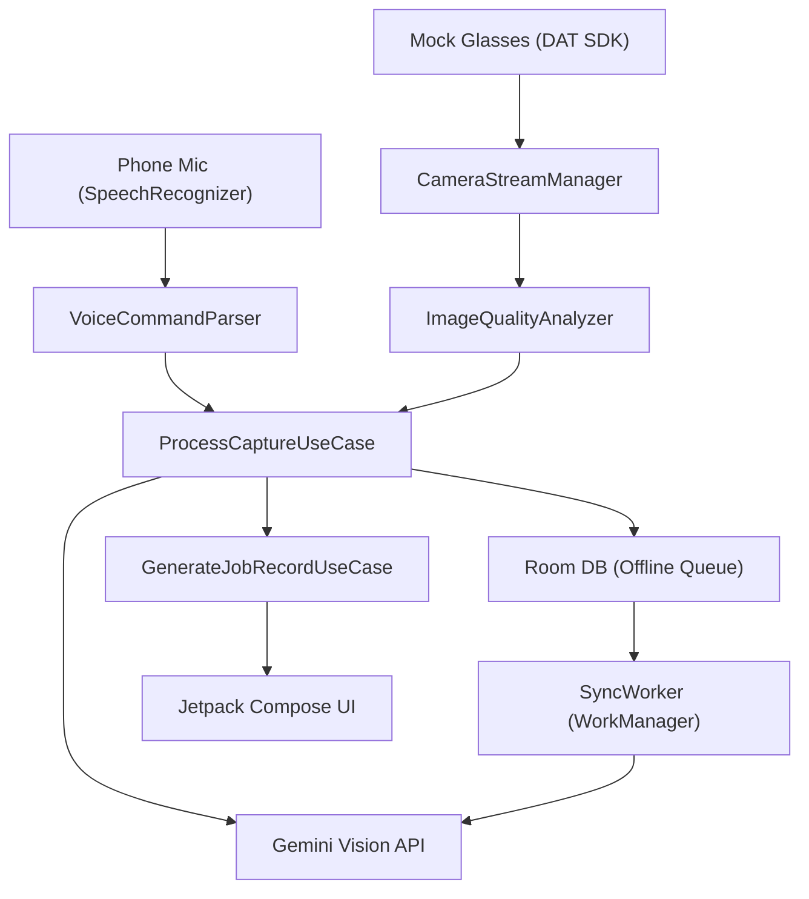

# FieldCapture Architecture

<!-- TODO: Expand architecture documentation and refine Mermaid diagram as implementation progresses. -->

```mermaid
flowchart TD
    Glasses["Mock Glasses (DAT SDK)"] --> Stream["CameraStreamManager"]
    Mic["Phone Mic (SpeechRecognizer)"] --> Parser["VoiceCommandParser"]
    Stream --> Quality["ImageQualityAnalyzer"]
    Parser --> Process["ProcessCaptureUseCase"]
    Quality --> Process
    Process --> Room["Room DB (Offline Queue)"]
    Process --> Gemini["Gemini Vision API"]
    Room --> Sync["SyncWorker (WorkManager)"]
    Sync --> Gemini
    Process --> Record["GenerateJobRecordUseCase"]
    Record --> UI["Jetpack Compose UI"]
```
